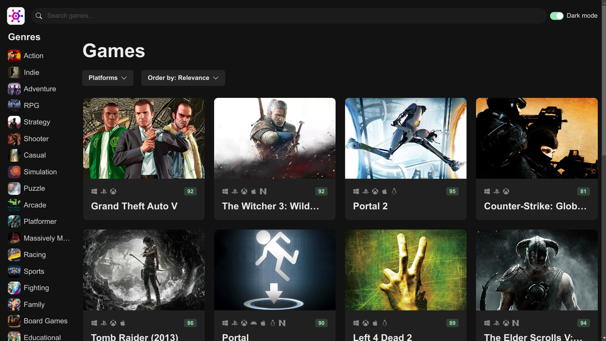

# Game Portfolio



This is a dynamic web application for video game enthusiasts. It allows users to explore, filter, and sort a wide variety of games, and provides detailed information and ratings for each game.

## Technologies Used

- React: A JavaScript library for building user interfaces.
- TypeScript: A typed superset of JavaScript that adds static types.
- Axios: A promise-based HTTP client for the browser and Node.js.
- ESLint: A tool for identifying and reporting on patterns found in ECMAScript/JavaScript code.
- Vite: A build tool that aims to provide a faster and leaner development experience for modern web projects.

## Getting Started

To get a local copy up and running, follow these steps:

1. Clone the repository:

```bash
git clone https://github.com/rcpc265/game-hub.git
```

2. Install the dependencies:

```bash
npm install
```

3. Get your own API key from [RAWG](https://rawg.io/apidocs). It's free! Once you have it, copy the `.env.example` file and rename it to `.env`:

```bash
cp .env.example .env
```

Then, open the .env file and replace your-api-key with your actual RAWG API key:

```bash
VITE_API_KEY=your-api-key
```

4. Start the development server:

```bash
npm run dev
```

5. Build for production:

```bash
npm run build
```

6. Build and preview the production build locally:

```bash
npm run preview
```

Enjoy the app!
